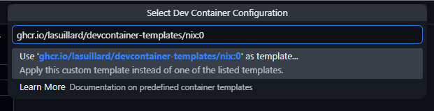

# devcontainer-templates

[](https://opensource.org/licenses/MIT)

Personal [Dev Container Templates](https://containers.dev/implementors/templates/).

## 📋 Using templates

You can see the list of available templates and their contents in the [src](./src) directory. To use a template, run the following commands:

```bash
$ devcontainer templates apply \
  --template-id ghcr.io/lasuillard/devcontainer-templates/nix:0 \
  --template-args '{"projectName": "lasuillard/my-new-project"}'
[2 ms] @devcontainers/cli 0.87.0. Node.js v24.15.0. linux 6.12.90+deb13.1-amd64 x64.
(node:16986) [DEP0169] DeprecationWarning: `url.parse()` behavior is not standardized and prone to errors that have security implications. Use the WHATWG URL API instead. CVEs are not issued for `url.parse()` vulnerabilities.
(Use `node --trace-deprecation ...` to show where the warning was created)
[1011 ms] Files to omit: 'devcontainer-template.json, README.md, NOTES.md'
{"files":["./.editorconfig","./.devcontainer/devcontainer.json","./.vscode/extensions.json","./.vscode/settings.json"]}

$ ls --all --recursive
.:
.  ..  .devcontainer  .editorconfig  .vscode

./.devcontainer:
.  ..  devcontainer.json

./.vscode:
.  ..  extensions.json  settings.json
```

If you use VS Code with the [Dev Containers](https://marketplace.visualstudio.com/items?itemName=ms-vscode-remote.remote-containers) extension, you can create a new dev container with `Dev Containers: New Dev Container...` from the command palette.



## 🧑‍💻 Development

See [CONTRIBUTING.md](./CONTRIBUTING.md) for development instructions.
